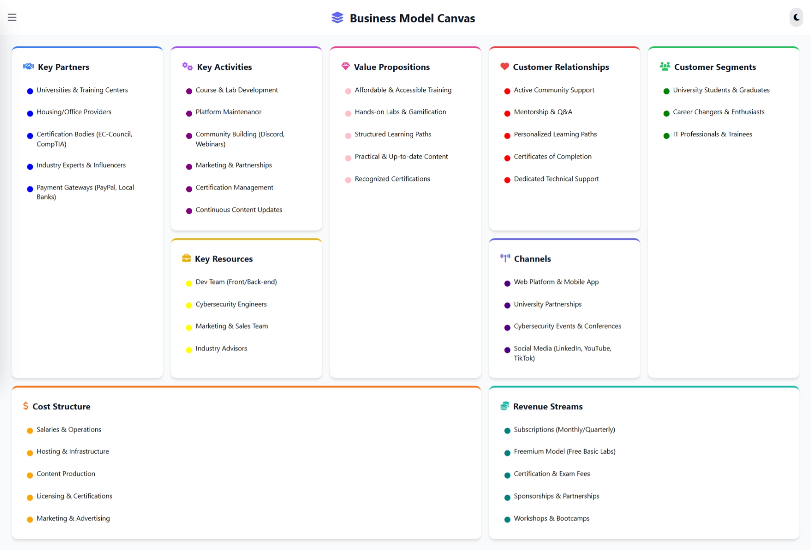
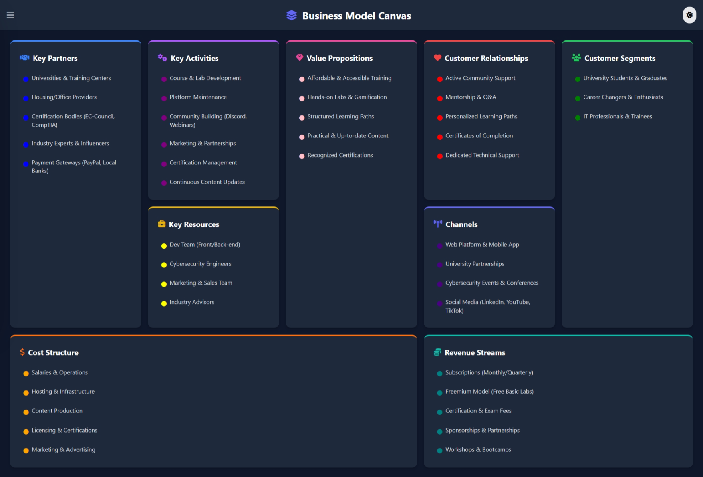
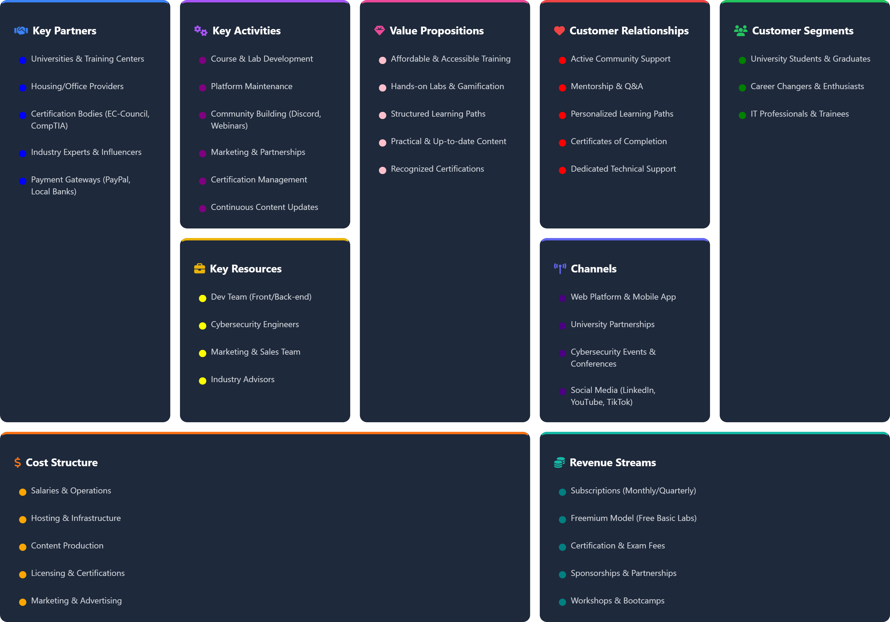

# CyberLabs BMC (Business Model Canvas)

An interactive **Business Model Canvas** web app built with **TailwindCSS**, **JavaScript**, and **MongoDB**. 🚀
This tool allows entrepreneurs, students, and startups to **design, edit, and manage their BMC** online with real-time database support.

---

## ✨ Features

- **Interactive Canvas** 📌 – Drag, resize, and edit business model sections.
- **Custom Colors** 🎨 – Change card background and text colors with a built-in color picker.
- **Secure Edit Mode** 🔑 – Password-protected editing.
- **Dark/Light Mode** 🌙 – Toggle between themes with a single click.
- **MongoDB Integration** 💾– Data automatically saved and loaded from the database.
- **Export Options** 📤 – Export your canvas as a **high-quality PNG or PDF**.
- **Responsive Design** 📱– Works across desktop and mobile devices.

---

## 🛠️ Tech Stack

- **Frontend:** HTML, TailwindCSS, JavaScript, FontAwesome
- **Backend:** Node.js, Express.js, MongoDB
- **Libraries:**
  - `html2canvas` (for screenshots)
  - `jsPDF` (for PDF export)

---

## 📂 Project Structure

```

├── assets/
│ ├── CSS/
│ │ └── style.css # Custom styles
│ ├── JS/
│ │ ├── main.js # App logic
│ │ └── tailwind.js # Tailwind config
│ └── imgs/ # Logos / favicon
├── data.js # Default canvas data
├── index.html # Main UI
├── server.js # Backend API (Express + MongoDB)
├── package.json # Node.js dependencies
├── .env # Environment variables (MongoDB, password, etc.)
└── README.md # Project documentation

```

---

## ⚙️ Installation & Setup

### 1. Clone Repository

```bash
git clone https://github.com/ahmedhussien1pro/Our-BMC.git
cd cyberlabs-bmc
```

### 2. Install Dependencies

```bash
npm install
```

### 3. Configure Environment Variables

Create a `.env` file in the project root:

```env
MONGODB_URI=your-mongodb-connection-string
PORT=3000
ADMIN_PASS=********
DB_NAME=********
COLLECTION_NAME=*******
```

### 4. Run Backend

```bash
node server.js
```

### 5. Open Frontend

Just open `index.html` in your browser.

---

## 🔐 Password Protection

- Edit Mode requires authentication.
- Default password: **`**\*\*\*\*\***\*`** (from `.env`).
- Change it by updating `ADMIN_PASS` in `.env`.

---

## 📤 Export Options

- **Export as PNG** – High-resolution canvas screenshot.
- **Export as PDF** – A4 landscape PDF including the whole canvas.
- Dark mode is preserved during export.

---

## 👨‍💻 Author

Developed by **CyberLabs Team** 💡
For more info, reach out at [cyberlabs@example.com](mailto:cyberlabs@example.com).

```

```

## 📸 Screenshots

### Light Mode



### Dark Mode



### Export as PDF



```

```
